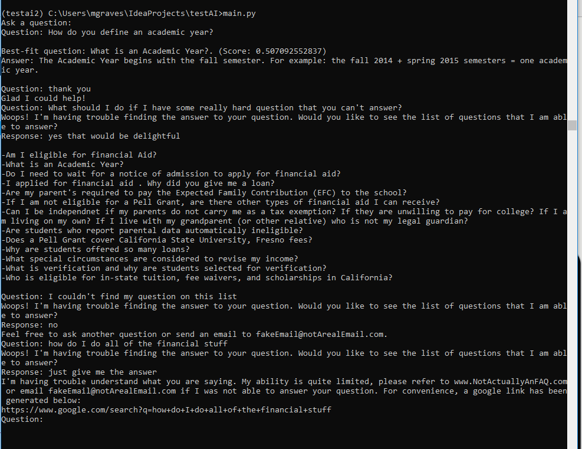
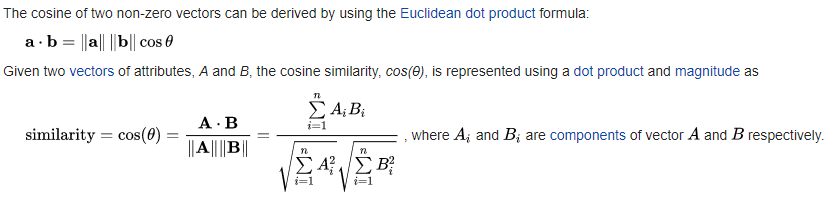

# Basic chat bot (Version 1.2)

## How to install
Download Python 2.7.x - https://www.python.org/downloads/

Download pip `sudo easy_install pip`

Download Virtualenvwrapper `pip install virtualenvwrapper`

Finally,
```commandline
mkvirtualenv chatbot
pip install -r requirements.txt
python main.py
``` 

## About the bot
The bot is trained on the FAQ page for a given site and uses that as it's corpus to compare the similarity between user input and known FAQ questions. If a good match is found it will return the answer, otherwise it will let the user know there was an issue.
What determines a 'good' similarity is defined in the Bot.settings object, by default we say that anything over a score of 50% is a good match but feel free to play around with this.
